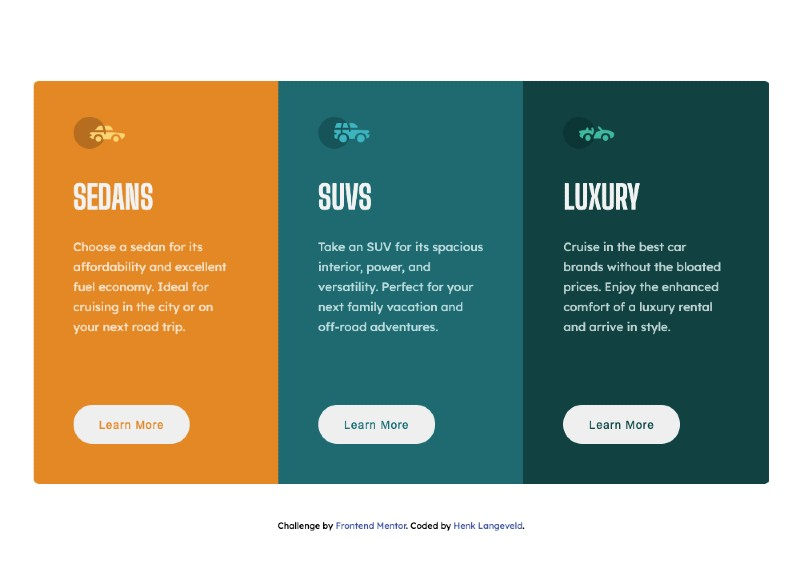
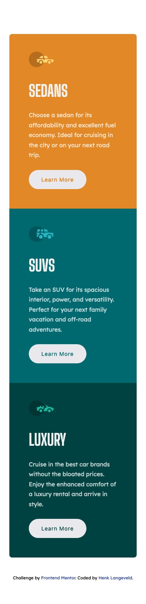

# Frontend Mentor - 3-column preview card component solution

This is a solution to the [3-column preview card component challenge on Frontend Mentor](https://www.frontendmentor.io/challenges/3column-preview-card-component-pH92eAR2-). Frontend Mentor challenges help you improve your coding skills by building realistic projects.

## Table of contents

- [Overview](#overview)
  - [The challenge](#the-challenge)
  - [Screenshot](#screenshot)
  - [Links](#links)
- [My process](#my-process)
  - [Built with](#built-with)
  - [What I learned](#what-i-learned)
- [Author](#author)

**Note: Delete this note and update the table of contents based on what sections you keep.**

## Overview

### The challenge

Users should be able to:

- View the optimal layout depending on their device's screen size
- See hover states for interactive elements

### Screenshot

Desktop:



Mobile:



### Links

- Solution URL: [Github](https://github.com/HenkLangeveld/3-column-card)
- Live Site URL: [Live](https://frontend-mentor-three-column-preview-card.netlify.app/)

## My process

After download of the challenge I first made the mobile version as pixel perfect as I could. After that I did the same for the desktop version. I figured out where I thought the breakpoint should be and made some adjustments.
I first used sass variables for the card colors but later switched to CSS custom properties which makes changing the card color easier for each card.

### Built with

- Semantic HTML5 markup
- CSS custom properties
- Flexbox
- Mobile-first workflow

### What I learned

With this SCSS code the background color and the text-color in the button can be changed by just changing the CSS custom property.

```css
:root {
  --orange: hsl(31, 77%, 52%);
  --cyan: hsl(184, 100%, 22%);
  --dark-cyan: hsl(179, 100%, 13%);
  --card-color: grey;
}

.card {
  &--sedan {
    --card-color: var(--orange);
  }
  &--suv {
    --card-color: var(--cyan);
  }
  &--luxury {
    --card-color: var(--dark-cyan);
  }

  background-color: var(--card-color);

  &__button {
    color: var(--card-color);
  }
}
```

## Author

- Website - [Henk Langeveld](https://www.henklangeveld.com/)
- Frontend Mentor - [@HenkLangeveld](https://www.frontendmentor.io/profile/HenkLangeveld)
